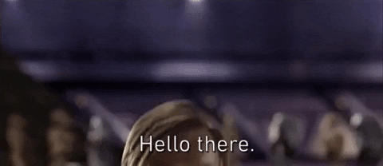

 

# Hello there! I'm Bien👋

**Open source is beautiful.** I deeply appreciate the people who build and share things openly with the world.🌏

Lately, I've been fascinated by ideas around [Ubiquitous Computing](https://en.wikipedia.org/wiki/Ubiquitous_computing), the [Quantified Self](https://en.wikipedia.org/wiki/Quantified_self), and [Crowdsourcing](https://en.wikipedia.org/wiki/Crowdsourcing), especially how technology can quietly integrate into our everyday life and help people make better decisions through data. I've also previously explored areas like Data Analytics, FinTech, and Logistics Planning. Do talk to me around these topics!

Recently graduated from [De La Salle University](https://www.dlsu.edu.ph/colleges/ccs/undergraduate-degree-programs/cs-st/) and am currently planning the major things ahead.🙏

I showcase more of my stuff in my website, check it out!👇

[aaronmiranda.site](https://www.aaronmiranda.site/)

or email me in:
[bienaaronmiranda@gmail.com](mailto:bienaaronmiranda@gmail.com)
[bien@aaronmiranda.site](mailto:bien@aaronmiranda.site)

<h2> Projects📌 </h2>

- WeCyclePH
  - WeCyclePH Mobile
- BoxCrib
- BikeSafe

<h2> Around the web </h2>

  
  
  
  
  

<h2>Tech Stack</h2>

**Desktop Development Technologies I've Built With 💻**

- Python
- Java
- C, C++
- and a little bit of Go, R, and Ruby

**WebDev Technologies I've Built With 🌐**

- Next.js, React, TypeScript, Tailwind CSS, Node.js, Express
- AWS, Firebase, Supabase

**Mobile Development Technologies I've Built With 📱**

- Kotlin
- React Native

**Technologies I Used for AI & Data Science 📊**

- ML Stack
  - Data Wrangling: Pandas, NumPy, Polars, SciPy (Statistical Analysis)
  - Preprocessing: Scikit-Learn (Scaling/Encoding), Imbalanced-learn (SMOTE)
  - Modeling: Logistic Regression, Random Forest, Gradient Boosting, Decision Trees
  - Visualization: Matplotlib, Seaborn, Plotly

**Technologies I Used for Ethical Hacking 🔐**

- Environment: Kali Linux
- Nmap, OpenVAS, Burp Suite, SQLmap, Wireshark, John the Ripper, Hashcat

**Technologies I'm Currently Learning 🌱**

- n8n
- Rust (testing it out)

<h2>Stats</h2>

  

<h2>Timeline <em>(soon)</em></h2>

> A table of my projects on a per-year basis — coming soon!

